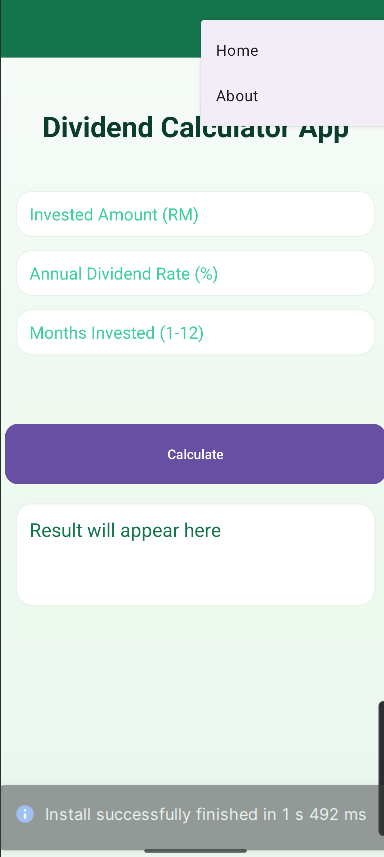

# 📱 **Unit Trust Dividend Calculator**

Mobile Technology & Development – Individual Assignment

This Android application calculates the monthly and total dividend based on the user’s unit trust investment. The app is developed using Android Studio with a clean, modern interface using a forest-green theme for a soothing financial-app feel.

---

## ✨ **Features**

### 🧮 **Dividend Calculator**

Users can enter:

* Invested Amount (RM)
* Annual Dividend Rate (%)
* Number of Months Invested (1–12)

The app automatically calculates:

* **Monthly Dividend**
* **Total Dividend** (rounded to 2 decimal places)

### 📘 **Formula Used**

```
Monthly Dividend = (Rate / 100 / 12) × Invested Amount  
Total Dividend   = Monthly Dividend × Number of Months
```

---

## 🏠 **Application Pages**

### **1️⃣ Home Page**

* Input fields for investment, rate, and months
* “Calculate” button
* Displays the calculated **monthly** and **total dividends**
* Fully designed using XML with responsive layout and custom colors

### **2️⃣ About Page**

Includes:

* Application icon
* Author name
* Matric number
* Course information
* Copyright
* **Clickable GitHub Repository link**

---

## 🎨 **UI & Design**

* Designed with XML layouts
* Forest-green theme (custom colors)
* Custom rounded panels and gradient backgrounds
* Toolbar with Material-style appearance
* Simple navigation menu with:

  * **Home**
  * **About**

---

## 🛠 **Technologies Used**

* Android Studio
* Java
* XML Layouts
* Material3 Toolbar
* Custom drawable shapes

---

## 📂 **Project Structure**

```
app/
 ├── java/                (Activities & calculation logic)
 ├── res/
 │    ├── layout/         (XML screens)
 │    ├── drawable/       (panels, gradients, buttons)
 │    ├── menu/           (navigation menu)
 │    ├── values/         (colors & styles)
 └── AndroidManifest.xml
```

---

## 📸 **Screenshots**

*(Replace placeholder images with real screenshots)*

### 🏠 Home Page


### ℹ️ About Page


### 🧮 Calculation Example


### 🧭 Taskbar


---

## 📦 **APK File**

The APK file is included in:

```
C:\Users\Nur\AndroidStudioProjects\IndividualAssignmentZakat\app\build\outputs\apk\debug
```

---

## 🔗 **GitHub Repository Link**

*(Replace with your real GitHub link)*
[(https://github.com/AthirahAzmi77/DividendCalculatorApp.git)]

---

## 👩‍💻 **Author**

**Name:** NUR ATHIRAH BINTI AZMI
**Matric No:** 2023406866
**Course:** CDCS240

---

## © **Copyright**

© 2025 Unit Trust Dividend Calculator.
All rights reserved.


